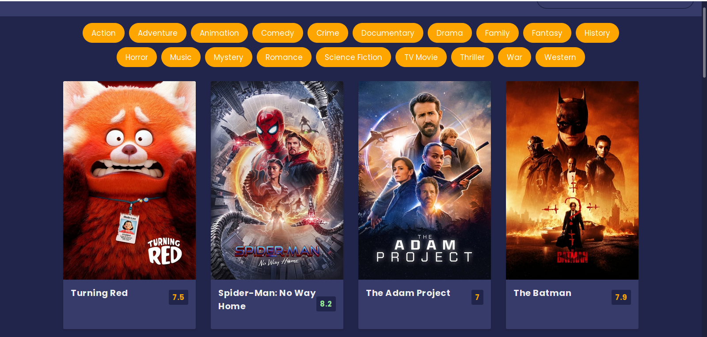

# Movie-App

## Overview
 
A movie app that uses an API to get movie titles, rating and overview.

### The challenge

The challenge was to make it use an  API  to get the movies  when searched and display their  Images, title, rating and lastly an overview .

when hovered over the cards an overview of the movie would pop up and the learn more button would take you to a youtube trailer video.

### Screenshot




### Links

- Solution URL: [Add solution URL here](https://your-solution-url.com)
- Live Site URL: [Add live site URL here](https://your-live-site-url.com)

### Built with

- Semantic HTML5 markup
- CSS custom properties
- Flexbox
- CSS Grid
- Mobile-first workflow
- Moviedb API

### What I learned

I learned about how to make filters and connect my search to youtube data base.

```js
const proudOfThisFunc = () => {
  console.log('🎉')
  data.forEach(movie => {
        const {title, poster_path, vote_average, overview, id} = movie;
        const movieEl = document.createElement('div');
        movieEl.classList.add('movie');
        movieEl.innerHTML = `
             

            <div class="movie-info">
                <h3>${title}</h3>
                <span class="${getColor(vote_average)}">${vote_average}</span>
            </div>

            <div class="overview">

                <h3>Overview</h3>
                ${overview}
                <br/> 
                <button class="know-more" id="${id}">Know More</button
            </div>
        
        `

        main.appendChild(movieEl);

        document.getElementById(id).addEventListener('click', () => {
          console.log(id)
          openNav(movie)
        })
    })
}

}
```


## Author

- Website - [Add your name here](https://www.your-site.com)
- Twitter - [@Amani_Off](https://www.twitter.com/yourusername)

